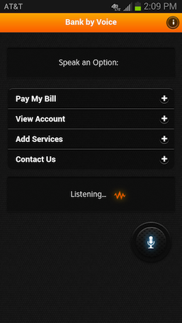
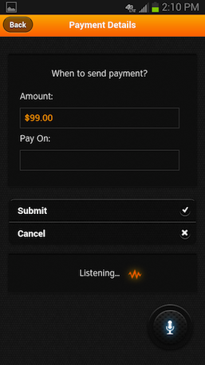
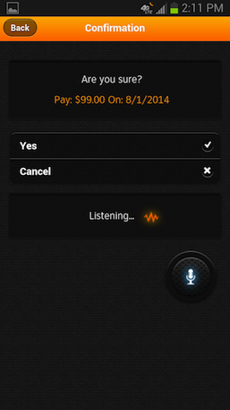

========================================================
AT&T API Platform Adapters for IBM Worklight
========================================================
The AT&T API Platform Adapters for IBM Worklight provide a simplified way for IBM Worklight
mobile developers to access the AT&T API platform services.  By significantly
reducing the complexity of building applications that use the AT&T platform 
services, the AT&T Adapters help developers quickly bring robust Worklight
mobile applications to market.

The AT&T Adapters provide interfaces that facilitate access to the following
AT&T Platform APIs:

<ul>
<li>Advertising</li>
<li>In App Messaging</li>
<li>OAuth</li>
<li>SMS</li>
<li>Speech To Text</li>
<li>Text To Speech</li>
</ul>

<table>
<tr>
<td></td>
<td></td>
<td></td>
</tr>
</table>

===============Tested versions===============
<ul>
<li>IBM MobileFirst Studio 7.0</li>
<li>Xcode 6.3.1</li>
<li>Android SDK Tools rev. 24.2</li>
<li>Apple Simulator: iOS 7.1 for both iPhone and iPad</li>
<li>iPhone 4s and 5</li>
<li>Android (Physical Device): 4.3, 4.4</li>
<li>Android Emulator: 4.2</li>
</ul>
